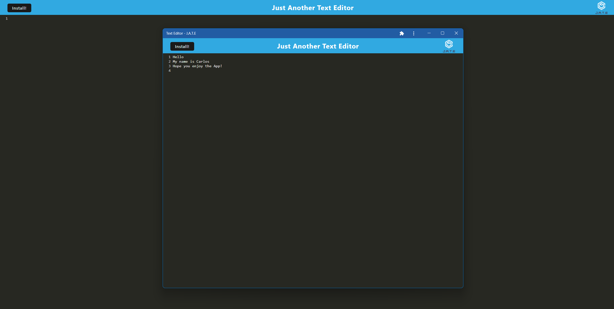

# CxLos19 Text Editor

## Description
```
The motivation in developing this project was to create a text editing app that can be used on or offline. I built this so that I can write down some handy notes and view them later. This app is meant to solve the issue of keeping track of notes wherever you are regardless of internet connection. In constructing this app, I learned a lot, primarily with service workers and manifest.json. I learned how they work together in progressive web apps to make an application more technologically up to date and perfom at higher quality.
```
## Table of Contents 
	
- [Installation](#installation)
- [Usage](#usage)
- [Credits](#credits)
- [License](#license)
- [Badges](#badges)
- [Features](#features)
- [Tests](#tests)


## Installation


## Usage

[CxLos19 Text Editor](https://cxlos19-text-editor.herokuapp.com/)



## Badges

N/A

## Features

N/A

## How to Contribute

N/A

## Tests

N/A

## Credits

N/A

## License

MIT License

Copyright (c) 2022 CxLos

Permission is hereby granted, free of charge, to any person obtaining a copy
of this software and associated documentation files (the "Software"), to deal
in the Software without restriction, including without limitation the rights
to use, copy, modify, merge, publish, distribute, sublicense, and/or sell
copies of the Software, and to permit persons to whom the Software is
furnished to do so, subject to the following conditions:

The above copyright notice and this permission notice shall be included in all
copies or substantial portions of the Software.

THE SOFTWARE IS PROVIDED "AS IS", WITHOUT WARRANTY OF ANY KIND, EXPRESS OR
IMPLIED, INCLUDING BUT NOT LIMITED TO THE WARRANTIES OF MERCHANTABILITY,
FITNESS FOR A PARTICULAR PURPOSE AND NONINFRINGEMENT. IN NO EVENT SHALL THE
AUTHORS OR COPYRIGHT HOLDERS BE LIABLE FOR ANY CLAIM, DAMAGES OR OTHER
LIABILITY, WHETHER IN AN ACTION OF CONTRACT, TORT OR OTHERWISE, ARISING FROM,
OUT OF OR IN CONNECTION WITH THE SOFTWARE OR THE USE OR OTHER DEALINGS IN THE
SOFTWARE.
